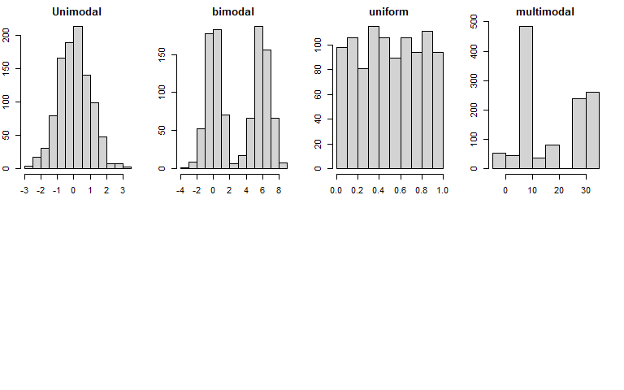
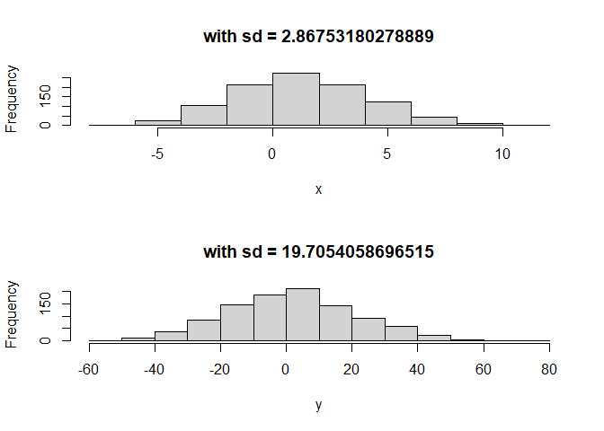

## **Visualizing Numerical Data** 

### **Scatterplots**  

Evaluating the relationship 

* Direction 
* Shape 
* strength (scatter)
* Outliers

### **Histogram**

* Provides view of the data density 
* Describing the shape of distribution (skew: right-left) 

### **Skewness**

*Distributions are skewed to the side of the long tail*

### **Modality**


```r
par(mfrow = c(2,4), mar = c(2,2,2,2))
z <- rnorm(1000)
hist(z, main = "Unimodal")

z <- c(rnorm(500, 0), rnorm(500, 6))
hist(z, main = "bimodal")

z <- runif(1000)
hist(z, main = "uniform")
      
z <- c(rnorm(100, 0), rnorm(500, 8), rnorm(100, 16), rnorm(500, 30))
hist(z, main = "multimodal")
```



* *Unimodal:* bell shape  
* *Bimodal:* there are two groups in the data  
* *Uniform:* there is no apparent trend in the data  


### **bin width**

the chose of the bin width affect the visualization 

### **Dot plot**


```r
library(ggplot2)
ggplot(mtcars, aes(x=mpg)) + geom_dotplot()
```

```
## `stat_bindot()` using `bins = 30`. Pick better value with `binwidth`.
```


### **box plot**


```r
library(ggplot2)
ggplot(mtcars, aes(x=mpg)) + geom_boxplot()
```


### **intensity map**

## **Measures of center**

If they are compute with a sample, they are called sample statistics (point estimate of the population parameter)

### **Mean**

```r
x <- rnorm(100)
mean(x)
```

```
## [1] 0.09417743
```
### **Median**

* first sort the data in an increasing order
* the find the midpoint
* *if is not exact* the median is the average of the middle two observations

```r
median(x)
```

```
## [1] 0.1429843
```

### **Mode**

very unlikely to find a mode in a continuous distribution 


```r
mode(x)
```

```
## [1] "numeric"
```

*La moda es coqueta*

**left skew**: the mean is lower that the median, the average is pull
to the lower end by the observation in the left tail

**right skew**: the mean is higher that the median, the average is pull to the upper end by the observation in the right tail


## **Measures of spread**

### **Range (max-min)**

### **variance**

Average squared deviation from the mean 


```r
x <- rnorm(1000, mean =  1, sd = 3)
y <- rnorm(1000, mean =  1, sd = 20)

par(mfrow=c(2,1))

hist(x,  main = paste("with sd =", sd(x)))

hist(y,  main = paste("with sd =", sd(y)) )
```



* reason to sum: 1) get rid of negative distances, 2)increase larger deviations more than smaller ones so thAt they are weighted more heavily 

### **Standard deviation**  

square root of the variance. Has the same units as the data  

### **variability vs. diversity**    


### **Interquartile range**

range of the middle 50% of the data, distance between the first quartile (25th percentile) and the third quartile (75th percentile)


```r
x <- rnorm(1000, mean =  1, sd = 3)
y <- rnorm(1000, mean =  1, sd = 20)
IQR(x)
```

```
## [1] 4.235106
```

```r
IQR(y)
```

```
## [1] 26.76188
```

```r
# IQR(x) > IQR(y)
```

**Advantage in comparisson with range** The IQR doesn't rely on the end points (that can be potential outliers.)

## **Robust Statistics**

We define *robust statistics* as measures on which extreme observations have little effect

**Center measure**

**median** robust to extreme observations than the **mean**

**Variation measure**

**IQR** robust to extreme observations than the **SD** and **Range**

If you have skewed distributions the **median** and **IQR** are the most convenient statistics

If you have Symmetric distributions the **mean** and **SD** are the most convenient statistics


## **Transformation of data**

A *transformation* is a rescaling of the data using a function 

When data the skewed is useful a *log transformation*

### **log transformation**

Applied when much of the data cluster near zero (relative to larger values in the data set) and all observation are positive *left skewed*

If the log transformation is applied to two variables, the relationship between them (in a scatterplot) becomes more linear

other transformations  

* square root transformation   
* inverse transformation   


