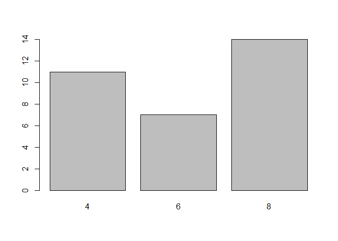
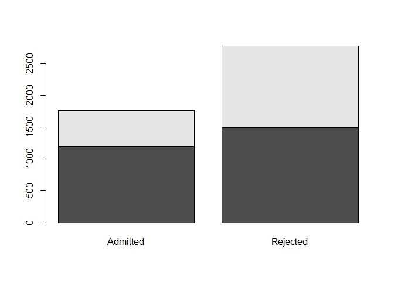
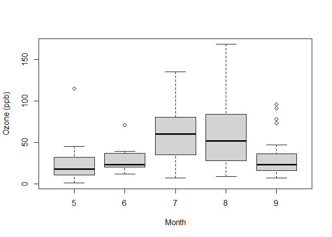

## **Exploring Categorical variables**

### **Frequency table and bar plot**


```r
table(mtcars$cyl)
```

```
## 
##  4  6  8 
## 11  7 14
```

```r
barplot(table(mtcars$cyl))
```



*barplot* different form *histogram*

### **Contingency table**


```r
data(UCBAdmissions)
DF <- as.data.frame(UCBAdmissions)
xt <- xtabs(Freq ~ Gender + Admit,data=DF) # CROSS TAB
xt
```

```
##         Admit
## Gender   Admitted Rejected
##   Male       1198     1493
##   Female      557     1278
```

### **segmented barplot**


```r
barplot(xt)
```



Visualizing conditional frequency distribution 

the alternative is calculate relative frequency segment barplot

### **Mosaicplot**

### **side-by-side boxplot**


```r
data("airquality")
library(dplyr)
```

```
## 
## Attaching package: 'dplyr'
```

```
## The following objects are masked from 'package:stats':
## 
##     filter, lag
```

```
## The following objects are masked from 'package:base':
## 
##     intersect, setdiff, setequal, union
```

```r
airquality <- mutate(airquality, Month = factor(Month)) 
boxplot(Ozone ~ Month, airquality, xlab = "Month", ylab = "Ozone (ppb)")
```



## **Introduction to inference**

* Start with the null hypothesis (H0) that represents the status quo  
* Set an alternative hypothesis (H1) that represents the research question   
* Conduct a hypothesis test under the assumption that the null hypothesis is true, either via simulation or theoretical methods
* If the test results suggest the data do not provide convincing evidence for the alternative hypothesis stick with the null hypothesis
* If they do, reject the null hypothesis in favor of the alternative

**Simulation**

in order to get to the conclusion, we can compare the actual data to a simulated distribution that suppose independence of the variables.

If the simulations do not look like the data ---> reject the null hypothesis


