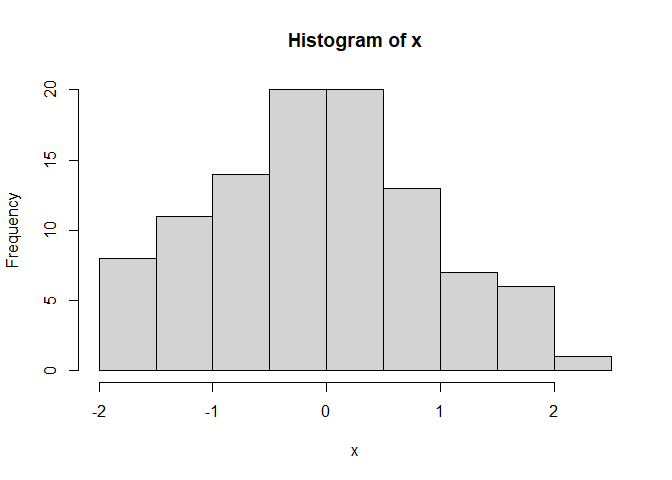
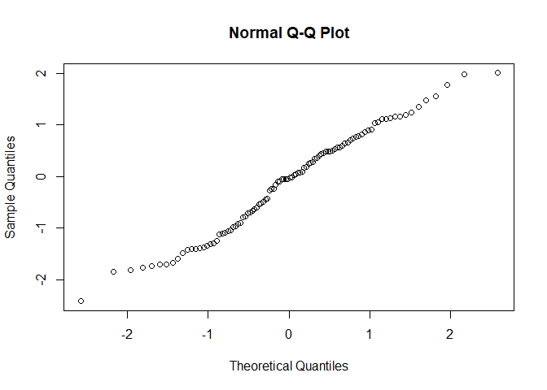

 
## **The normal distribution**

* Unimodal and symmetric  
* Follow strict rules about how variably the data are distributed around the mean  
* Due to these rules, although many variables are nearly normal, none are exactly normal   

### **Strict rules: 68- 95 -99.7%**


</center>

### **Standardizing with Z scores**

*Standardizing with Z score* of an observation is the number of standard deviations it falls above or below the mean


</center>

We can have standardize scores for any distribution that have mean and sd.

### **Percentiles**

When the distribution is normal, Z scores can be used to calculate percentiles

*Percentile* is the percentage of observation that fall below a given data point

Graphically, is the area below the probability distribution curve to the left of that observation

If the distribution does not follow the normal distribution, in order to calculate percentiles we would need to use calculus (integrals).

in R....


```r
pnorm(-1, mean = 0, sd=1)
```

```
## [1] 0.1586553
```

```r
pnorm(1800, mean = 1500, sd=300)
```

```
## [1] 0.8413447
```

```r
pnorm((1800-1500)/300, mean = 0, sd=1)
```

```
## [1] 0.8413447
```

or we can find cutoff values corresponding to a desired percentile


```r
qnorm(0.9, mean = 1500, sd=300)
```

```
## [1] 1884.465
```

```r
qnorm(0.1, mean = 21, sd=5)
```

```
## [1] 14.59224
```

## **Evaluate if a distribution is normal**

## **Normal probability plot**

Data are plotted on the y axis, and theoretical quantiles on the x axis.

If there is a one-to-one relationship between the data and the theoretical quantiles, then the data follow a nearly normal distribution.


</center>

in R... qqnorm function


```r
x<-rnorm(100)
hist(x)
```

<!-- -->

```r
qqnorm(x)
```

<!-- -->

```r
y<-rexp(100)
median(y)
```

```
## [1] 0.7236375
```

https://rstudio-pubs-static.s3.amazonaws.com/198393_3b9d87c451334863a0850be4ae605e39.html
