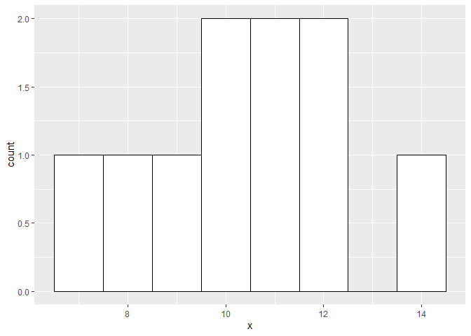
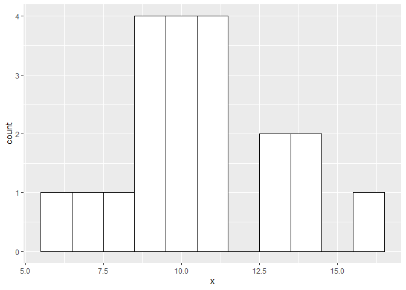
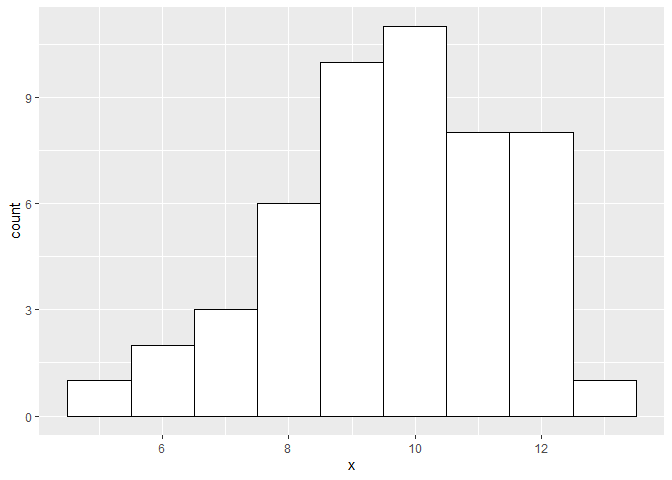
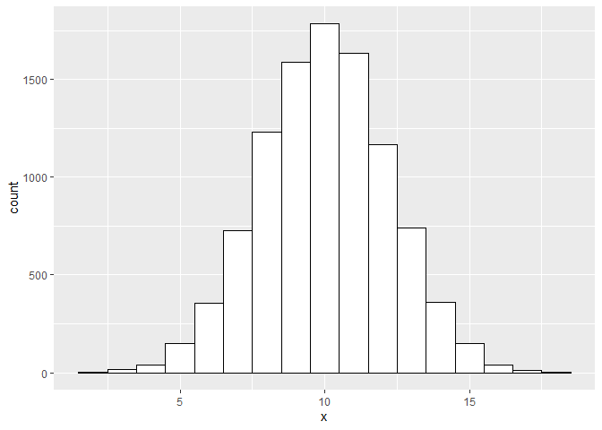

## **Binomial Distribution**

### **Bernoulli random Variables**

When an individual trial has only two possible outcomes, it is called a Bernoulli ***Bernoulli random variables***

The ***binomial distribution*** describes the probabilty of having exactly k successes in n independent Bernouilli trials with probability of succes p

in an archaic way:
<center> 
 number of scenarios x P(single scenario)
</center>

### **P(single scenario)**
<center> 

</center>

### **number of scenarios**

we will use the combination function

<center> 

</center>

in R...

```r
choose(9,2)
```

```
## [1] 36
```

### **Binomial Distribution**

Putting all together...

<center> 

</center>

### **Binomial conditions**

1. The trials must be independent
2. The number of trials, n, must be fixed
3. each trial outcome must be classified as a success or a failure
4. the probability of success, p, must be the same for each trial.

in R...

```r
dbinom(8, size = 10, p = 0.13)
```

```
## [1] 2.77842e-06
```

```r
dbinom(2, size = 3, p = 0.51)
```

```
## [1] 0.382347
```

### **Expected value (mean) of binomial distribution and Standard Deviation**

<center> 

</center>

## **Normal approximation to binomial**


```r
library(ggplot2)
x <- rbinom(10,20,0.5)
x
```

```
##  [1]  8 12 12  7 11 10 10  9 14 11
```

```r
ggplot() +
  geom_histogram(
    aes(x), 
    binwidth = 1, 
    fill = "white", 
    color = "black"
  )
```

<!-- -->

```r
x <- rbinom(20,20,0.5)
ggplot() +
  geom_histogram(
    aes(x), 
    binwidth = 1, 
    fill = "white", 
    color = "black"
  )
```

<!-- -->

```r
x <- rbinom(50,20,0.5)
ggplot() +
  geom_histogram(
    aes(x), 
    binwidth = 1, 
    fill = "white", 
    color = "black"
  )
```

<!-- -->

```r
x <- rbinom(10000,20,0.5)
ggplot() +
  geom_histogram(
    aes(x), 
    binwidth = 1, 
    fill = "white", 
    color = "black"
  )
```

<!-- -->

### **Two methods: Normal Approximation, or exact calculation**


```r
# normal approximation
1- pnorm(70,61.25,6.778)
```

```
## [1] 0.09836202
```

```r
1- pnorm(50,44.8,5.679)
```

```
## [1] 0.1799242
```

```r
# Exact result
sum(dbinom(70:245, size = 245, p = 0.25))
```

```
## [1] 0.112763
```

```r
# We can correct the approximation using 69.5 instead of 70

sum(dbinom(1:10, size = 10, p = 0.07))
```

```
## [1] 0.5160177
```


### **How to know if the binomial distribution approach to the normal distribution?**

<center> 

</center>


